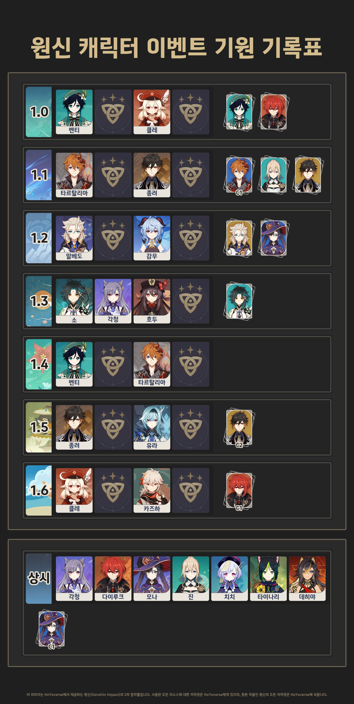

# pythonPILExample

[파이썬 크롤러 예제](https://github.com/SuhYeoJee/pythonCrawlerExample#pythoncrawlerexample)
에서 다운받은 이미지를 사용해서 다음과 같은 결과를 얻는다. 

사실 업무에서 자주 사용한 라이브러리는 아니지만   
무엇보다 재미가 있기 때문에 겸사겸사 정리한다. 

과연 연휴가 끝나기 전에 정리할 수 있을 것인가?
